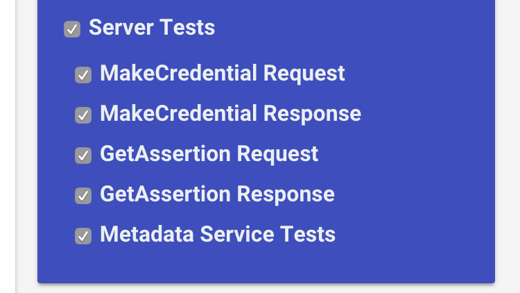
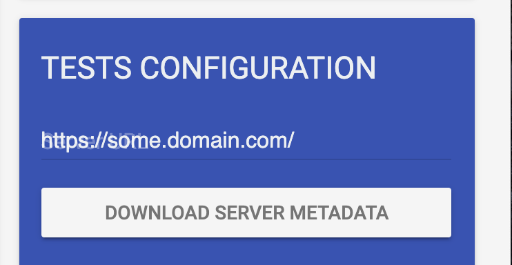
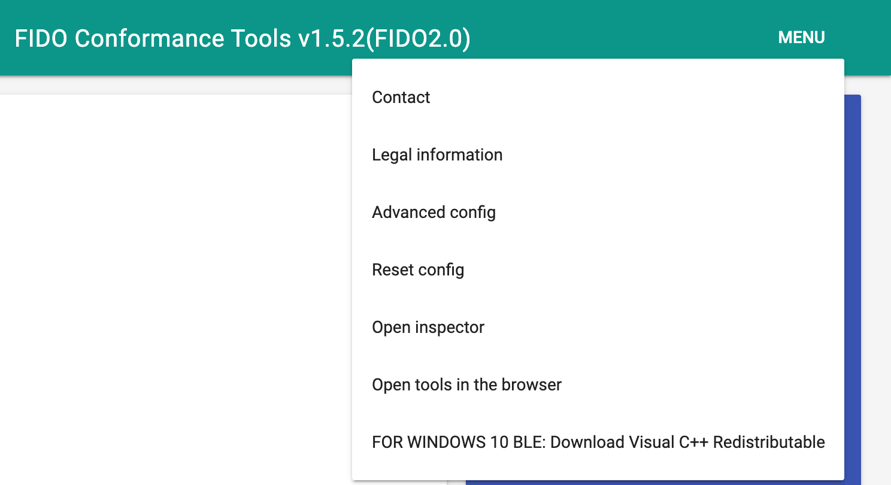
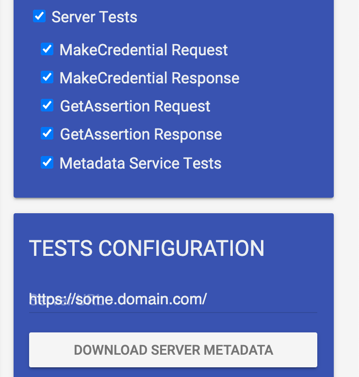
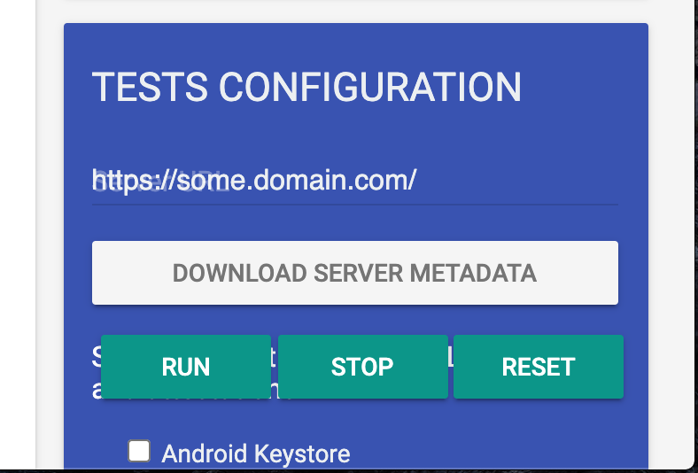

# Running FIDO2 Server tests

## FIDO2 Server Tests Options

1. MakeCredential Request
2. MakeCredential Response
3. GetAssertion Request
4. GetAssertion Response
5. Metadata Service Tests

You can choose these options what you want to test.

## Preparations and Configurations

* Setup your FIDO2 server with HTTPS enable access.
* Click "DOWNLOAD SERVER METADATA" to download metadata and register metadata to your server.
* Register your server url at https://fidoalliance.co.nz/mds/ and add provided MDS endpoints to your server.
* Then you can find 5 url for MDS. Setup those 5 urls to access from your server.
* Launch FIDO Conformance Tools and set your server url into text box at TESTS CONFIGURATION.

* If you want to capture network while testing, launch inspector tool from Menu -> Open Inspector menu.

* Check the options you want to test.

## Run tests

* After you complete preparations and configurations, just click a green "RUN" button.

## Test Results
* You can see the results of tests on top of the tool's screen.

* If you don't find any number of failure, you can see the RED "SUBMIT RESULT" button on bottom of application screen.

## Submit Results

* Click RED "SUBMIT RESULT" button to submit result to FIDO alliance.
* You need to run 5 test cases at once to submit successful results. If you run 5 test cases separately, you cannot see red "SUBMIT RESULT" button even if your server passes all test items.

## Test Items

* Bellow lists describes mandatory test items.(some of lists are optional.)
* The "P" in the number like "P-n" means the server should return correct  successful response.
* The "F" in the number like "F-n" means the server should return correct error response.

### "MakeCredential Request"

#### Server-ServerPublicKeyCredentialCreationOptions-Req-1

Test server generating ServerPublicKeyCredentialCreationOptionsRequest

### "MakeCredential Response"
#### Server-ServerAuthenticatorAttestationResponse-Resp-1 

Test server processing ServerAuthenticatorAttestationResponse structure

#### Server-ServerAuthenticatorAttestationResponse-Resp-2

Test server processing CollectClientData

#### Server-ServerAuthenticatorAttestationResponse-Resp-3

Test server processing AttestationObject

#### Server-ServerAuthenticatorAttestationResponse-Resp-4

Test server support of the authentication algorithms

#### Server-ServerAuthenticatorAttestationResponse-Resp-5

Test server processing "packed" FULL attestation

#### Server-ServerAuthenticatorAttestationResponse-Resp-6

Test server processing "packed" SELF(SURROGATE) attestation

#### Server-ServerAuthenticatorAttestationResponse-Resp-7

Test server processing "none" attestation

#### Server-ServerAuthenticatorAttestationResponse-Resp-8

Test server processing "fido-u2f" attestation

#### Server-ServerAuthenticatorAttestationResponse-Resp-9

Test server processing "tpm" attestation

#### Server-ServerAuthenticatorAttestationResponse-Resp-A

Test server processing "android-key" attestation

#### Server-ServerAuthenticatorAttestationResponse-Resp-B

Test server processing "android-safetynet" attestation

### "GetAssertion Request"
#### Server-ServerPublicKeyCredentialGetOptionsResponse-Req-1

Test server generating ServerPublicKeyCredentialGetOptionsResponse

### "GetAssertion Response"
#### Server-ServerAuthenticatorAssertionResponse-Resp-1

Test server processing ServerAuthenticatorAssertionResponse structure

#### Server-ServerAuthenticatorAssertionResponse-Resp-2

Test server processing CollectClientData

#### Server-ServerAuthenticatorAssertionResponse-Resp-3

Test server processing authenticatorData

### "Metadata Service Tests"
#### Server-ServerAuthenticatorAttestationResponse-Resp-1

Test server processing ServerAuthenticatorAttestationResponse structure

